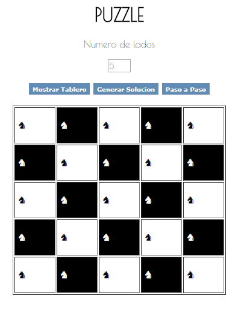
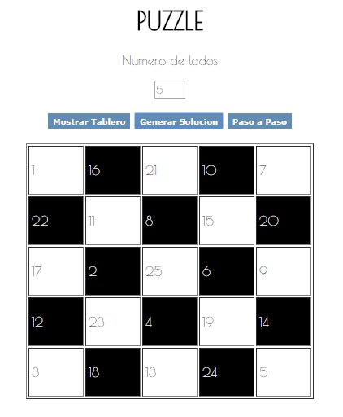
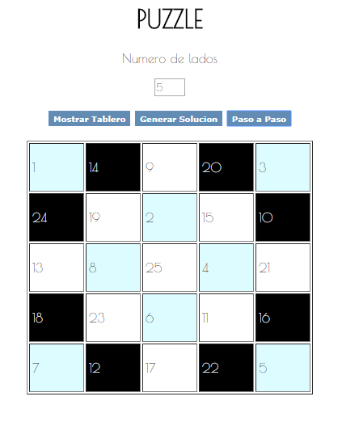

# Tabla
Trabajo evaluado:
He utilizado lo aprendido en los sprints anteriores.
## HTML
Realice correctamente el html y lo relacione con el archivo javascript y el archivo css.
* Hago uso de tres botones
## CSS
Utilice clases y etiquetas
* Tambien utilice fuentes de letras de google font.
##  JAVASCRIPT
Basado en el codigo del profesor implemente tres botones funcionales
*Añadi tambien una funcion llamada tablita

# TRABAJO

* Funcionalidad del primer boton

* Funcionalidad del segundo boton

* Funcionalidad del tercer boton

